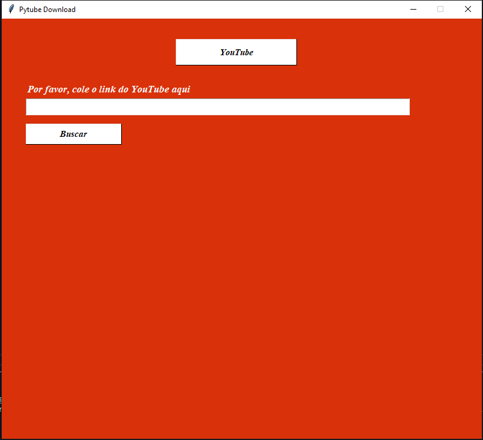
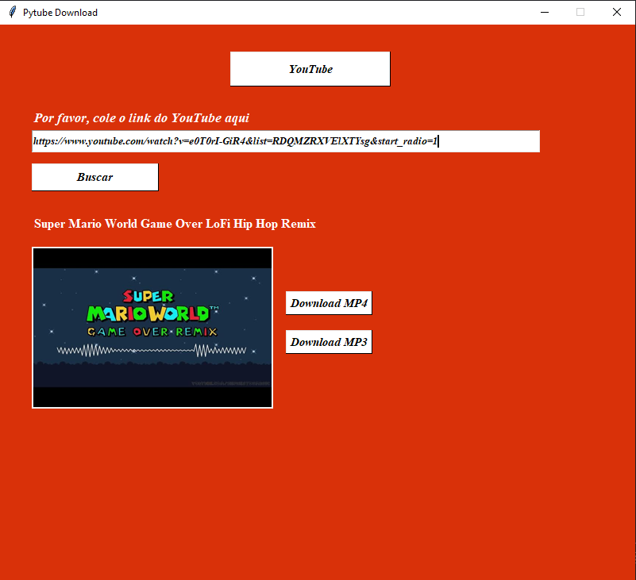

# **Programa que faz download de **video MP4** e **audio MP3** feito em Python.**

Fiz esse simples programa que faz download de **vídeos** e **áudios** do Youtube, 
usando a biblioteca Pytube e Tkinter.

# **Bibliotecas principais:**

* **Pytube** - https://pytube.io/en/latest/index.html
* **Tkinter** - https://docs.python.org/3/library/tkinter.html

# **Como o programa funciona?**

**Primeiro passo, execute o programa:**

Na tela do programa temos o botão **Youtube** e **barra de pesquisa**. O botão do Youtube quando clicado ele direcionará você para a plataforma de música do site.

**Segundo passo, coloque o link da sua preferência:**

Depois de ter colocado o link da sua preferência, ele mostrará o **título** e **opção para download**. 

Vamos selecionar as duas opções download **MP4** e **MP3**

Depois de termos **selecionado as duas opções** o programa vai ter feito o **download nos dois formatos**.

**Observação:** Você pode adaptar o programa com um diretório de sua preferência ou aprimorar o programa para ele perguntar em qual diretório deseja.

